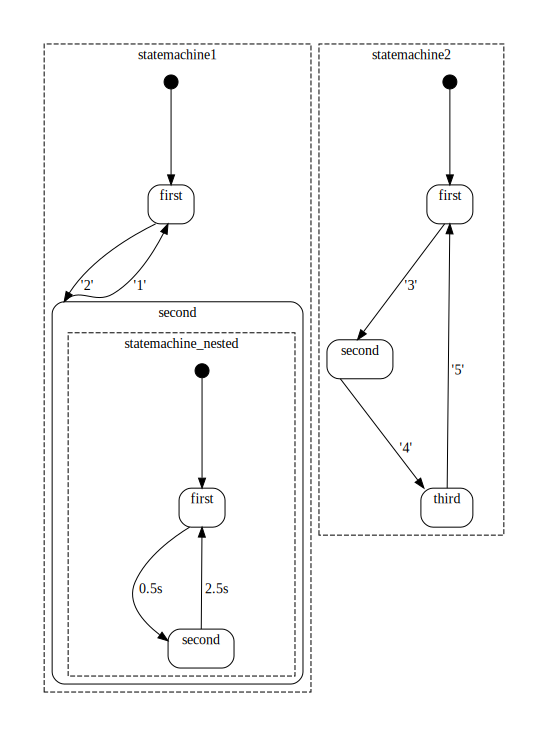

# C statecharts

Write statecharts in C using macros.

## Description

By using a few C macros, a statechart with transitions can be defined.
During runtime execution events can be created that fire the transitions
and change the states accordingly. Timers are supported as well as
parallel execution and nesting. Finally, a document mode can be 
activated that produces output for graphviz which will in turn 
generate and automatically layout a statechart diagram.

## Getting Started

### Dependencies

* C language, no specific OS, but the example is geared towards Linux
* It uses parts from Protothread by Adam Dunkels, these are included.

### Installing

* Create the executable a.out with by calling
```
gcc cstatechart.c main.c 
```

### Executing the program

* The program can be run after compilation using
```
./a.out
```
The program does not stop, so the key combination ctrl+c 
is needed to send a signal to the program stopping it.

### Self-documentation of a program

The document mode can be activated by setting #define DOCUMENT 1
 in cstatechart_settings.h. It will change the program so that instead
 of running the statechart it rather prints a dot file to the console. 
 Recompilation, running the program
 and conversion of the resulting file can be done with
```
gcc cstatechart.c main.c 
./a.out > test.dot
dot -T pdf test.dot  > test.pdf
```
Instead of calling dot, you can paste the contents of the dot file
to the website http://viz-js.com/.

The output looks like this:



## API

* The main loop of running a statechart should look like this
```
  INIT(&cs1);
  INIT(&cs2);
  INIT(&cs_nested);
  EXECUTE_BEGIN 
    RUN( statemachine1, cs1 );
    RUN( statemachine2, cs2 );
  EXECUTE_END
```
  The INIT function must be called once on all statechart data variables.
  The EXECUTE_ macros are an endless loop that deqeue events and
  automatically call all statemachine functions using the RUN macro.
  The statemachine execution is considered parallel, although no 
  threads are used.
* Statemachine
  * A statemachine needs a data variable of type cs_t.
  * Each statemachine is a function that must have a cs_t parameter. 
    All states are defined within the macros BEGIN(cs)
    and END(cs). All states are defined sequential and have a name. 
    Each state may have multiple (or no) TRANSITION macros to other
    states within this function. The ON_ENTER and ON_EXIT macros
    finally contain user code to be executed when the state is entered 
    or exited. An example for a statemachine function is
```
static int statemachine1(cs_t* cs)
{
  BEGIN(cs)

  STATE(cs,first)
    TRANSITION(cs,'2', second);
    ON_ENTER
    {
      printf("state 1, parameter: %i\n", *((int*)cs_get_event_parameter()) );
    }
    ON_EXIT
    {
      printf("Left state 1\n");
    }
  ENDSTATE(cs,first);
  
  STATE(cs,second)
    TRANSITION(cs,'1', first);
    ON_ENTER
    {
      printf("state 2\n");
    }
    ON_EXIT
    {
      printf("Left state 2\n");
    }
    RUN(statemachine_nested, cs_nested);
  ENDSTATE(cs,second);

  END(cs)
}
```

* Transitions are created using the TRANSITION macro. Parameters are
  the statemachine data cs_t, the event-id and the target state. Whenever
  the event-id is fired, the state is changed to the target.
* Timed transitions are created using TIME_TRANSITION, which has
  the parameters statemachine data cs_t, time in seconds and the target 
  state. This event is fired after the timer elapsed. The timer starts
  when the state is entered.
* Events 
  * They can be injected into the system by calling cs_add_event( some_number ).
    The example uses characters from the keyboard, but this should rather
    be an enum. Parameters are buffered.
  * Events that should be fired can be added via for example
    cs_add_event_with_parameter( 123, "hi" ).
    Within ON_ENTER/ON_EXIT, the parameter can be accessed using 
    char* cs_get_event_parameter(). 
  * Events can be generated in a statemachine to trigger transitions
    in another statemachine. 
* Parallel states
  * By calling the RUN macro multiple times within an EXECUTE_ or within
  a STATE pair, these statemachine functions are called in parallel. Well
  not really but both are executed in sequence and as they do not block
  especially when no transition is fired, they can be regarded parallel.
* Substatemachines
  * When calling the RUN macro in a state pair, the state function that 
  is called is nested. When the parent statemachine leaves the state
  containting the RUN macro, the nested statemachine is not called again.
  Note: the child statemachine currently is not informed about the exit.

## Features

* parallel state DONE
* substates      DONE
* events         DONE
* parameters     DONE
* timers         DONE
* history states DONE

## Problems

* Parameters problem: there are no parameters for initial and timed transitions, 
  but the user can call cs_get_event_parameter(). Maybe timer events
  should be default events with a predefined event_id.
* Busy waiting for the example, it uses 100% CPU. But this is
  intentional, as we are using clock(), which uses CPU runtime.
  So doing a sleep would massively slow down timed transitions.
* Better time control for specific OS:
  * get current time point
  * get difference between two timepoints
  * sleep that does not alter time measurement
  * adustable time resolution like 0.01s or similar
* Harel's statechart semantics and syntax are not met. But the enforced 
  sequence of statemachine->states->(sub-)statemachine->states->... 
  appears to be correct, as calling parallel statemachines is an
  easy way to get parallelism going. Calling sub-statemachines feels
  like good encapsulation, too, I think.
* Maybe change some complex macros into function calls.
* Better readable output for dot files. Messy right now.
* Non-history statemachine exit and general exit behaviour 
  is not defined.

## Help

* Do not use blocking calls within the statecharts, better use polling.
* One problem when using documentation mode is that no real production
  code should be called. The macros ON_ENTER and ON_EXIT are ignored,
  so most system code should go there.
* All event ids are integers, so it might be beneficial to create an
  enum event_id{ event1 = 0, event2, ... };
* Because the macros generate switch/case entries, no other switch/cases
  should be used within a statemachine function . In case it is a must 
  and the gnu c compiler is used, the same workaround as in Protothread
  can be used.

## Authors

dasmuli

## Version History

* 0.1
    * Initial Release

## License

See license file

## Acknowledgments

* Adam Dunkels' Protothread actually solved all problems regarding 
  state defintion, transitions, parallelism and nesting.
* David Harel for inventing statecharts I guess, using them for years
  now (with a complex visual tool). 
  Cf. "Statecharts: a visual formalism for complex systems."
* The people behind graphviz.

